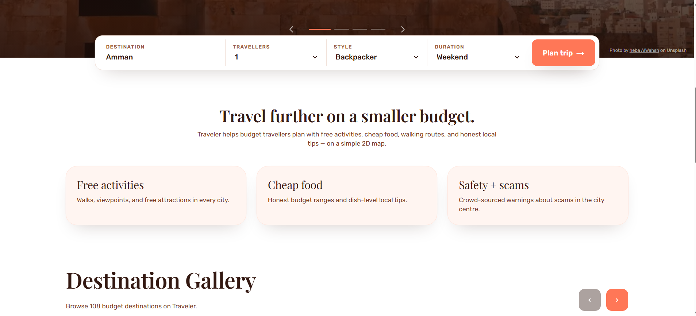
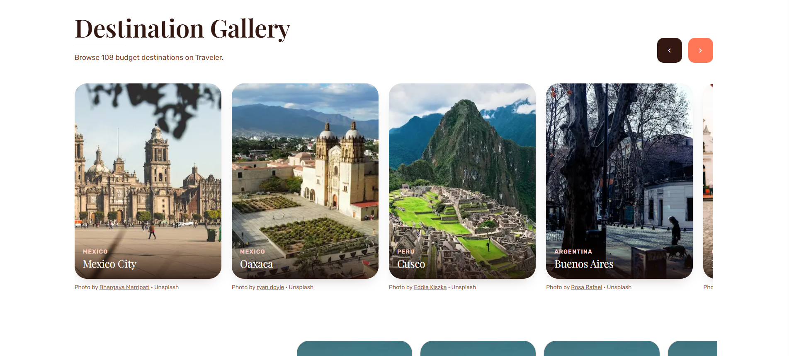
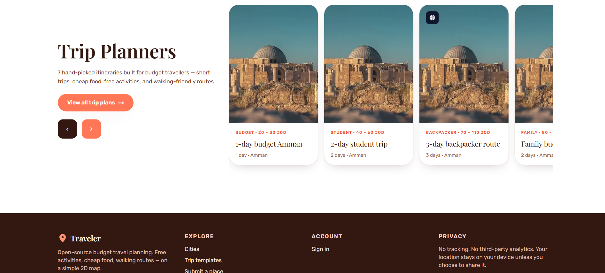
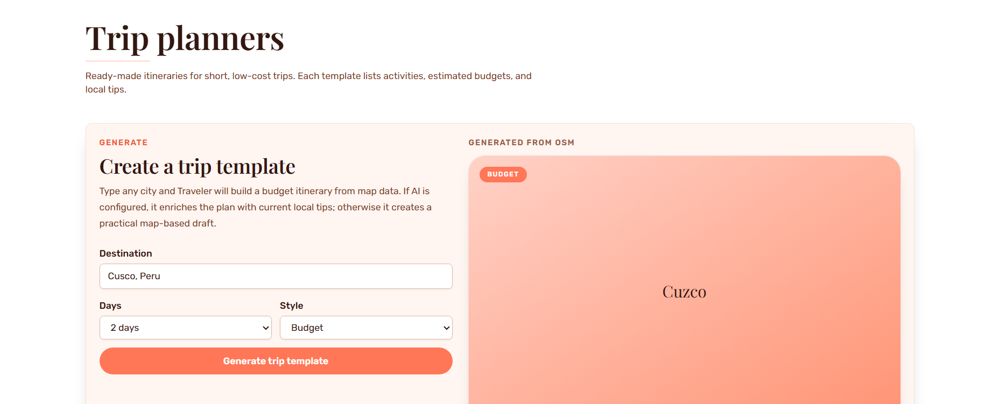
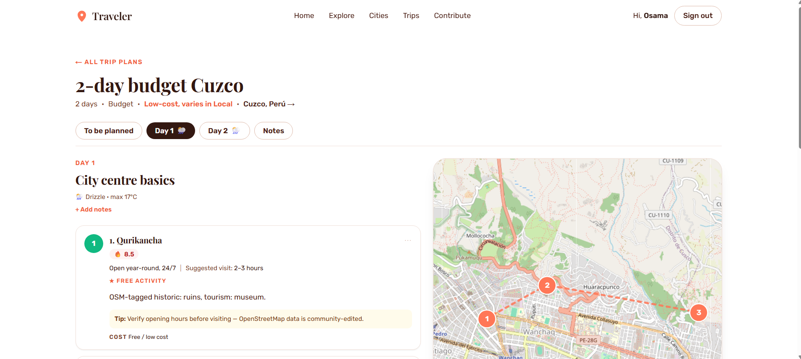

# 🌍 Traveler

**Traveler** is a low-cost, open-source travel planning web app designed for budget travelers. It helps you discover free activities, cheap food, public transport, walking routes, and safety tips—all on a simple, high-performance 2D map.

> *"Plan your next adventure without the premium price tag. Built for travelers, by travelers."*

---

## ✨ Key Features

-   📍 **Smart Map Discovery**: Interactive 2D Leaflet map powered by OpenStreetMap (zero paid map APIs).
-   🤖 **AI-Generated Guides**: Type any city to generate a live map enriched with local tips and budget itineraries (powered by Anthropic Claude).
-   🚶 **Optimized Walking Routes**: Routes follow real streets using OSRM, complete with distance, time, and difficulty metrics.
-   💸 **Budget Focus**: Dedicated filters for free activities, water refill points, markets, and hostel areas.
-   ⚠️ **Safety First**: Real-time crowd-sourced safety and scam warnings for every city.
-   📝 **Community Driven**: Submit new places and help verify community contributions through the admin dashboard.

---

## 📸 Screenshots

| 🏠 Landing Page | 🗺️ City Map View |
| :---: | :---: |
|  |  |
| **🔍 Place Details** | **🚶 Walking Routes** |
|  |  |
| **📋 Trip Templates** | **➕ Community Submissions** |
|  |  |

---

## 🤝 Contributing

We welcome contributions from the community! Whether you're fixing a bug, adding a feature, or improving documentation:

1.  **Fork** the repository.
2.  **Create** a feature branch (`git checkout -b feature/amazing-feature`).
3.  **Commit** your changes (`git commit -m 'Add amazing feature'`).
4.  **Push** to the branch (`git push origin feature/amazing-feature`).
5.  **Open** a Pull Request.

Please ensure you run `npm run lint` and `npm run type-check` before submitting.

---

## 🛡️ Privacy & Security

-   **Zero Tracking**: No third-party analytics or tracking scripts.
-   **Local First**: User location is optional and never stored on our servers.
-   **Secure Auth**: Powered by Firebase's industry-standard security.

---

## 📜 License

Distributed under the MIT License. See `LICENSE` for more information.

---

## 🗺️ Roadmap

- [ ] Save favorite places per user
- [ ] Offline city guides (PDF export)
- [ ] Service worker for full offline map support
- [ ] Multilingual support (i18n)
- [ ] Community voting on routes

---

Developed with ❤️ for the global travel community.
