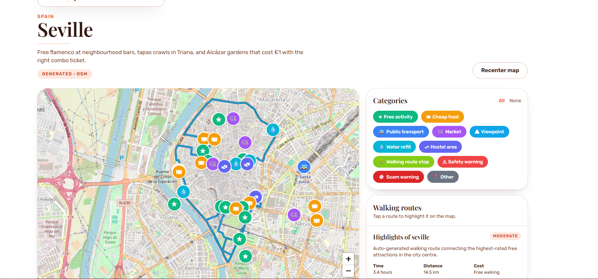

# Traveler

A low-cost, open-source travel planning web app for budget travelers. Traveler
helps you discover **free activities, cheap food, public transport points,
walking routes, safety warnings, scam warnings, and budget trip templates** on a
simple 2D map.

> "Budget travel planning with free activities, cheap food, and simple 2D maps."

## Features

- 2D Leaflet map (OpenStreetMap tiles — no paid map APIs)
- **Type any city → live-generated map** using:
  - [Nominatim](https://nominatim.openstreetmap.org/) for geocoding (free, no key)
  - [Overpass](https://overpass-api.de/) for places with coordinates (free, no key)
  - [OSRM](https://router.project-osrm.org/) so generated walking routes
    follow real streets instead of straight lines (free, no key)
  - [Anthropic Claude](https://www.anthropic.com/api) (Opus 4.7) with the
    `web_search` tool to enrich descriptions, local tips, walking routes, and
    budget itineraries
  - Falls back to raw OSM data if no AI key is configured
- City pages with category filters: free activities, cheap food, public
  transport, markets, viewpoints, water refill, hostel areas, walking-route
  stops, safety warnings, scam warnings, other
- Click any marker for details: name, category, estimated cost, description,
  local tip, and last updated date
- Walking routes shown as 2D polylines with a side panel of stops, distance,
  time, and difficulty
- Budget trip templates: 1-day, 2-day, 3-day, student, backpacker, and family
- Submit a place form for community contributions (status: `pending`)
- Admin submissions page with approve / reject actions
- Firebase Authentication structure (email + Google)
- Works in mock mode when Firebase is not configured

## Screenshots

| Landing Page | City Map View |
| :---: | :---: |
|  |  |
| **Place Details Popup** | **Walking Routes Panel** |
|  |  |
| **Budget Trip Templates** | **Submit New Place** |
|  |  |
| **Admin Submissions Review** | |
|  | |

## Tech stack

- [Next.js](https://nextjs.org/) (App Router) + React
- [Tailwind CSS](https://tailwindcss.com/)
- [Leaflet](https://leafletjs.com/) + [React-Leaflet](https://react-leaflet.js.org/)
- [Firebase](https://firebase.google.com/) (Authentication + Firestore)
- Hosted on Firebase Hosting or Vercel

## Setup

### 1. Install dependencies

```bash
npm install
```

### 2. Configure Firebase

#### 2a · Create the project

Create a Firebase project at <https://console.firebase.google.com/>, then
inside the project:

- **Build → Firestore Database → Create database** — start in **production
  mode** (the repo ships rules), pick a region close to your users
  (immutable after creation).
- **Build → Authentication → Get started → Sign-in method**:
  - Enable **Email/Password**
  - Enable **Google**
- **Project settings (gear) → Your apps → `</>` Web app** — register the app
  and copy the `firebaseConfig` block.

#### 2b · Wire env vars

Copy your web app config into a `.env.local` at the repo root:

```bash
cp .env.example .env.local
```

Fill in:

```
NEXT_PUBLIC_FIREBASE_API_KEY=...
NEXT_PUBLIC_FIREBASE_AUTH_DOMAIN=...
NEXT_PUBLIC_FIREBASE_PROJECT_ID=...
NEXT_PUBLIC_FIREBASE_STORAGE_BUCKET=...
NEXT_PUBLIC_FIREBASE_MESSAGING_SENDER_ID=...
NEXT_PUBLIC_FIREBASE_APP_ID=...
```

If any of these are missing, the app falls back to bundled sample data and
mock submissions so you can still develop locally.

> The `NEXT_PUBLIC_` prefix is correct here — the Firebase Web SDK runs in
> the browser. Firebase API keys are not secrets in the OAuth-key sense;
> security comes from Firestore Rules + Authentication, not from hiding the
> key.

#### 2c · Deploy security rules + indexes

The repo ships [`firestore.rules`](firestore.rules) (admin-aware
read/write rules for cities, places, routes, submissions, users) and
[`firestore.indexes.json`](firestore.indexes.json) (composite indexes for
`(cityId, status)` queries on places + routes).

Install the Firebase CLI once:

```bash
npm install -g firebase-tools
firebase login
firebase use <your-project-id>   # or: firebase init
```

Deploy:

```bash
npm run deploy:rules
```

This runs `firebase deploy --only firestore:rules,firestore:indexes`. Rules
and indexes update instantly; index builds on existing data can take a few
minutes (Console → Firestore → Indexes shows progress).

#### 2d · Seed the sample data

Until your Firestore collections have content, every list query returns
empty and the app falls back to sample data. To push the bundled
[`sampleData.ts`](src/lib/sampleData.ts) (34 cities, sample places +
routes + templates) up to Firestore:

1. **Firebase Console → Project settings → Service accounts →
   Generate new private key.** Save as `serviceAccount.json` at the repo
   root. The file is gitignored.
2. Install one-time deps and run the seed:
   ```bash
   npm install --save-dev firebase-admin tsx
   npm run seed
   ```

The script ([`scripts/seed-firestore.ts`](scripts/seed-firestore.ts)) is
idempotent — it merges by document ID, so you can re-run after editing
`sampleData.ts` to push updates. Batches in groups of 400 to stay under the
500-op Firestore commit limit.

#### 2e · Make yourself an admin

The default rules treat any user as `role: "user"`. The admin submissions
page and write paths require `role: "admin"`. After signing in once:

- Console → Firestore → `users` collection → your `uid` document → edit
  the `role` field from `"user"` to `"admin"`.

Or via shell with the Admin SDK:

```ts
await db.collection("users").doc("<uid>").update({ role: "admin" });
```

### Optional: Unsplash photos

For destination imagery on the home hero, gallery, and trip planner cards,
add an Unsplash Access Key from <https://unsplash.com/oauth/applications>:

```
UNSPLASH_ACCESS_KEY=...
```

Server-side only (no `NEXT_PUBLIC_` prefix). **Do not store the Unsplash
Secret Key** — it's for OAuth login flows we don't use, and exposing it
broadens the blast radius if leaked. Without this key, cards fall back to
gradient placeholders.

Photo attribution is automatic — every image renders a "Photo by …" credit
linking back to the photographer with the required `utm_source` parameter.

### Optional: looping video hero (Pexels)

The landing-page hero plays a muted, looping background video over the
Unsplash poster. Unsplash has no video API, so we use **Pexels Videos** for
video and keep **Unsplash** for photos.

Get a free Pexels API key at <https://www.pexels.com/api/> and add it:

```
PEXELS_API_KEY=...
```

Free tier: 200 requests/hour, 20K/month. Results are cached for 24 hours so
the hero hits Pexels at most once per day per query.

Server-side only — never prefix with `NEXT_PUBLIC_`. The component:

- picks the best ≤1080p MP4 from the API response (skips 4K and HLS)
- autoplays muted with `playsInline` so mobile browsers cooperate
- uses `preload="metadata"` so the initial payload stays small
- falls back to the Unsplash poster if the video errors or no key is set

### Optional: AI enrichment with Claude

For richer descriptions, local tips, walking routes, and itineraries, add an
Anthropic API key from <https://console.anthropic.com/>:

```
ANTHROPIC_API_KEY=sk-ant-...
CLAUDE_MODEL=claude-opus-4-7
```

The key is server-side only (no `NEXT_PUBLIC_` prefix) so it never reaches
the browser. Without this key, live-generated cities still work — they
use raw OpenStreetMap data without AI enrichment.

> **Important**: never commit `.env.local` and never paste your API key into
> chat, issues, or PR descriptions. If a key is exposed, rotate it
> immediately at <https://console.anthropic.com/settings/keys>.

### How "live generation" works

When the user types a city that isn't in static data:

1. **Nominatim** geocodes the name → lat/lng + country (free, no key).
2. **Overpass** fetches POIs around that point — viewpoints, markets, food,
   water refill, transport, attractions (free, no key). If sparse, the
   radius automatically expands from 5 km to 9 km.
3. **Claude Opus 4.7** (if configured) uses the `web_search` tool to verify
   current prices and opening hours, then writes descriptions and local tips
   for each place, plus a walking-route stop order and a 2-day budget
   itinerary.
4. **OSRM** (Open Source Routing Machine) takes those stops and returns the
   actual walking path along real streets — so the polyline on the map
   bends with sidewalks and pedestrian zones instead of cutting straight
   through buildings. OSRM also returns the real walking distance and
   duration, which override the LLM's estimates.
5. The result is cached in-process (per server instance).

OSM (Nominatim + Overpass + OSRM) is the only required network dependency
and is free. Anthropic billing applies only when an API key is configured.

### Optional: self-host OSRM for production

The default routing endpoint (`https://router.project-osrm.org`) is OSRM's
public demo server — fine for development, fair-use only. For production
traffic, [host your own OSRM](https://github.com/Project-OSRM/osrm-backend)
and override the URL via env:

```
OSRM_BASE_URL=https://your-osrm-instance.example.com
```

`scripts/seed-firestore.ts` and the runtime generator both honour this.

### 3. Run locally

```bash
npm run dev
```

Open <http://localhost:3000>.

### 4. Build for production

```bash
npm run build
npm start
```

## Folder structure

```
traveler/
  README.md
  package.json
  .env.example
  src/
    app/
      page.tsx                       # Home
      cities/page.tsx                # Cities list
      cities/[cityId]/page.tsx       # City map page
      templates/page.tsx             # Budget trip templates
      submit/page.tsx                # Submit a place
      login/page.tsx                 # Sign in
      admin/submissions/page.tsx     # Admin review
    components/
      layout/{Navbar,Footer}.tsx
      map/{TravelerMap,MapMarker,MapFilters,RouteLayer,RoutePanel,PlacePopup}.tsx
      places/{PlaceCard,PlaceList}.tsx
      templates/TripTemplateCard.tsx
      forms/SubmitPlaceForm.tsx
      admin/SubmissionReviewCard.tsx
    lib/
      firebase.ts        # Firebase init (safe when env is missing)
      firestore.ts       # Read/write helpers + sample-data fallbacks
      constants.ts       # Categories, labels, tile layer
      sampleData.ts      # Amman city, places, route, templates
      types.ts           # TypeScript types
      validators.ts      # Validation utilities
    styles/
      globals.css
```

## Firestore collections

| Collection      | Key fields                                                                                                  |
| --------------- | ----------------------------------------------------------------------------------------------------------- |
| `users`         | `id, name, email, role, savedPlaces, createdAt`                                                             |
| `cities`        | `id, name, country, centerLatitude, centerLongitude, defaultZoom, currency, description`                    |
| `places`        | `id, cityId, name, category, latitude, longitude, estimatedCost, description, localTip, openingHours, source, status, createdAt, updatedAt` |
| `routes`        | `id, cityId, name, estimatedTime, estimatedDistance, estimatedCost, difficulty, stops, coordinates, description, status, createdAt, updatedAt` |
| `tripTemplates` | `id, cityId, title, days, travelStyle, estimatedBudget, itinerary, tips, createdAt, updatedAt`              |
| `submissions`   | `id, userId, type, cityId, data, status, createdAt, reviewedAt, reviewedBy`                                 |

## Privacy

- The app does **not** store user location by default.
- Browser geolocation is optional only and never persisted.
- No tracking scripts. No third-party analytics.
- Personal travel routes are not stored unless the user explicitly saves them.

## Contribution

This project is open-source friendly. Contributions are welcome:

1. Fork the repo and create a feature branch.
2. Run `npm run lint` and `npm run type-check` before opening a PR.
3. Keep dependencies minimal — avoid paid APIs as required dependencies.
4. Add or update sample data in `src/lib/sampleData.ts` when piloting new
   cities.

If you submit a new place through the app, it will appear on the admin
submissions page until an admin approves it.

## Future roadmap

- Save favorite places per user
- Download city guides (offline JSON / PDF)
- Full offline support (service worker + cached tiles)
- Community voting on places and routes
- Price update reports (crowd-sourced cost refresh)
- More cities and regions
- Multilingual support (i18n)

## License

MIT — see `LICENSE` (add one before publishing).
